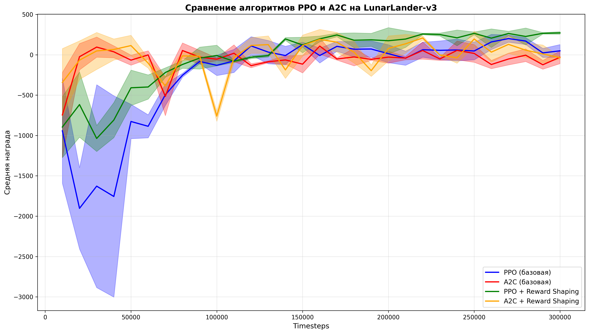
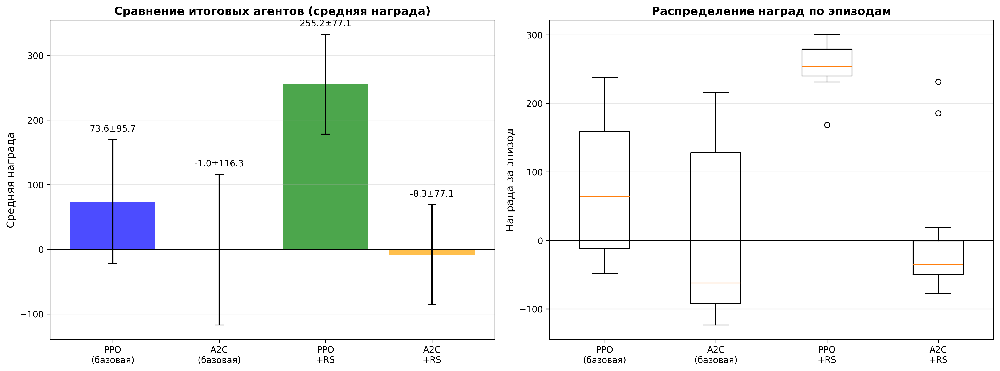

# Сравнение алгоритмов обучения с подкреплением на среде LunarLander-v3

## Описание проекта

Проект представляет собой сравнительное исследование алгоритмов обучения с подкреплением (Reinforcement Learning) на среде **LunarLander-v3** из библиотеки Gymnasium. В рамках исследования сравниваются два алгоритма:

- **PPO (Proximal Policy Optimization)** - алгоритм с обрезкой политики для стабильности обучения
- **A2C (Advantage Actor-Critic)** - более простой алгоритм на основе преимущества

Для каждого алгоритма тестируются две версии:
1. **Базовая версия** - без модификаций функции награды
2. **Версия с Reward Shaping** - с добавлением штрафа за использование топлива

### Цель

Продемонстрировать умение применить готовый RL-алгоритм (можно использовать stable-baselines3) для решения стандартной задачи, провести контролируемые эксперименты и проанализировать их влияние на обучение. 

## Требования

- Python 3.8+
- Jupyter Notebook или JupyterLab
- Все зависимости указаны в `requirements_freeze.txt`

## Установка

### 1. Клонирование репозитория

```bash
git clone <repository-url>
cd track1-session
```

### 2. Создание виртуального окружения (рекомендуется)

```bash
python -m venv .venv
source .venv/bin/activate  # Для Linux/Mac
# или
.venv\Scripts\activate  # Для Windows
```

### 3. Установка зависимостей

```bash
pip install -r requirements_freeze.txt
```

Или установка основных библиотек вручную:

```bash
pip install gymnasium swig stable-baselines3 torch numpy matplotlib imageio "gymnasium[box2d]" imageio-ffmpeg tensorboard
```

## Запуск

### Запуск через Jupyter Notebook

1. Запустите Jupyter Notebook:
```bash
jupyter notebook
```

2. Откройте файл `sample.ipynb`

3. Выполните ячейки последовательно. Ноутбук содержит:
   - Установку зависимостей
   - Настройку параметров эксперимента
   - Обучение четырех агентов (PPO базовый, A2C базовый, PPO с Reward Shaping, A2C с Reward Shaping)
   - Визуализацию результатов
   - Создание видео работы агентов

### Параметры эксперимента

В ноутбуке можно изменить следующие параметры:

```python
ENV_NAME = 'LunarLander-v3'  # Название среды
SEED = 42                    # Seed для воспроизводимости
TOTAL_TIMESTEPS = 300000     # Количество шагов обучения
EVAL_EPISODES = 20           # Количество эпизодов для финальной оценки
```

### Структура проекта

```
track1-session/
├── sample.ipynb              # Основной ноутбук с кодом
├── requirements_freeze.txt    # Зафиксированные версии пакетов
├── models/                    # Сохраненные модели
│   ├── ppo_final.zip
│   ├── a2c_final.zip
│   ├── ppo_rs_final.zip
│   ├── a2c_rs_final.zip
│   └── .../best_model.zip    # Лучшие модели
├── data/                      # Данные и графики
│   ├── comparison_timesteps.png
│   ├── final_evaluation.png
│   └── */evaluations.npz     # Данные оценки
└── videos/                    # Видео работы агентов
    ├── PPO (базовая).gif
    ├── A2C (базовая).gif
    ├── PPO + Reward Shaping.gif
    └── A2C + Reward Shaping.gif
```

## Отчет о результатах

### Сводная таблица результатов

| Агент | Средняя награда | Стандартное отклонение | Диапазон |
|-------|----------------|----------------------|----------|
| **PPO (базовая)** | 73.56 | ± 95.72 | [-48.0, 238.1] |
| **A2C (базовая)** | -0.96 | ± 116.30 | [-123.5, 215.9] |
| **PPO + Reward Shaping** | **255.18** | ± 28.75 | [168.6, 300.4] |
| **A2C + Reward Shaping** | -8.35 | ± 77.12 | [-77.1, 231.6] |

### Лучший результат

**Победитель: PPO + Reward Shaping** со средней наградой **255.18**

Этот агент показал:
- Самую высокую среднюю награду
- Наименьшее стандартное отклонение (28.75), что указывает на стабильность
- Самый узкий диапазон результатов, демонстрирующий консистентность

### Графики результатов

#### 1. Сравнение обучения по времени (timesteps)

График показывает динамику обучения всех четырех агентов в процессе тренировки:



**Комментарии:**
- PPO с Reward Shaping показывает стабильный рост награды на протяжении всего обучения
- Базовая версия PPO также демонстрирует положительную динамику, но с большей вариативностью
- A2C алгоритмы показывают менее стабильное обучение, особенно базовая версия A2C

#### 2. Финальная оценка агентов

График сравнивает итоговые результаты всех агентов после обучения:



**Комментарии:**
- Левый график (столбчатая диаграмма) показывает средние награды с доверительными интервалами
- Правый график (box plot) демонстрирует распределение наград по эпизодам
- PPO + Reward Shaping имеет наименьший разброс результатов (компактный box plot)
- Базовая версия PPO показывает высокую вариативность, что видно по широкому box plot

### Визуализация работы агентов

Видео работы обученных агентов можно найти в папке `videos/`:

- [PPO (базовая)](videos/PPO%20(базовая).gif)
- [A2C (базовая)](videos/A2C%20(базовая).gif)
- [PPO + Reward Shaping](videos/PPO%20+%20Reward%20Shaping.gif)
- [A2C + Reward Shaping](videos/A2C%20+%20Reward%20Shaping.gif)

## Анализ результатов

### Сравнение алгоритмов PPO и A2C

#### PPO (Proximal Policy Optimization)
- **Преимущества:**
  - Использует clipping для стабильности обучения
  - Показывает более стабильную сходимость
  - Лучше справляется с задачей в обеих версиях (с Reward Shaping и без)
  
- **Недостатки:**
  - Требует больше вычислительных ресурсов
  - Более сложный алгоритм

#### A2C (Advantage Actor-Critic)
- **Преимущества:**
  - Более простой алгоритм
  - Обычно быстрее на итерацию
  
- **Недостатки:**
  - Менее стабилен, чем PPO
  - Показывает худшие результаты в данном эксперименте
  - Может требовать больше итераций для сходимости

### Влияние Reward Shaping

Добавление штрафа за использование топлива (`fuel_penalty_weight=0.01`) оказало значительное влияние на результаты:

1. **Для PPO:**
   - Резкое улучшение результатов (с 73.56 до 255.18)
   - Значительное снижение вариативности (с ±95.72 до ±28.75)
   - Более стабильная и предсказуемая стратегия посадки

2. **Для A2C:**
   - Незначительное улучшение (с -0.96 до -8.35, но с меньшей вариативностью)
   - Алгоритм все еще показывает отрицательные средние награды
   - Reward Shaping не смог компенсировать нестабильность A2C

### Выводы

1. **PPO превосходит A2C** в задаче LunarLander-v3 как по стабильности, так и по итоговым результатам

2. **Reward Shaping критически важен** для достижения высоких результатов, особенно для PPO

3. **Комбинация PPO + Reward Shaping** является оптимальной стратегией для данной задачи:
   - Высокая средняя награда (255.18)
   - Низкая вариативность (±28.75)
   - Стабильная стратегия посадки

4. **Экономия топлива** через Reward Shaping приводит к более эффективной стратегии посадки, что выражается в более высоких наградах

## Технические детали

### Архитектура моделей

- **PPO:** Использует стандартную архитектуру Stable-Baselines3 с MLP (Multi-Layer Perceptron)
- **A2C:** Аналогичная архитектура, но с другим алгоритмом обновления политики

### Параметры обучения

- Общее количество шагов: 300,000
- Частота оценки: каждые 10,000 шагов
- Seed: 42 (для воспроизводимости)
- Окружение: LunarLander-v3

### Reward Shaping

Штраф за использование топлива применяется следующим образом:
- Действия 1, 2, 3 (использование двигателей) получают штраф -0.01
- Это побуждает агента использовать двигатели более экономно
- Приводит к более плавным и эффективным посадкам

## Воспроизводимость

Для обеспечения воспроизводимости результатов:
- Использован фиксированный seed (42) для всех генераторов случайных чисел
- Версии всех пакетов зафиксированы в `requirements_freeze.txt`
- Все модели сохранены в папке `models/`

## Дополнительные ресурсы

- [Stable-Baselines3 Documentation](https://stable-baselines3.readthedocs.io/)
- [Gymnasium Documentation](https://gymnasium.farama.org/)
- [LunarLander Environment](https://gymnasium.farama.org/environments/box2d/lunar_lander/)


